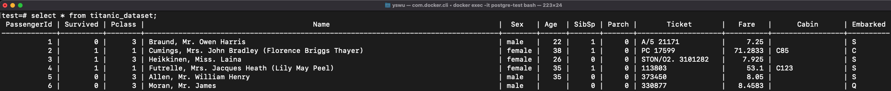

# [Dockerize] PostgreSQL and load it with a sample dataset (Titanic)
## Steps:
Download a PostgreSQL container and run it
1. docker pull postgres
2. docker run --name postgre_test -e POSTGRES_PASSWORD=pass -d -p 5432:5432 postgres

Enter the iterative mode of the PostgreSQL instance and create Database
1. docker exec -it postgre_test bash
2. psql -U postgres
3. create database test;

After running the Python Script to upload the titanic dataset to PostgreSQL, Check the DB
1. \c test
2. \d titanic_dataset
3. select * from titanic_dataset;

## Result:

## Reference:
Dockerize PostgreSQL
* https://www.youtube.com/watch?v=aHbE3pTyG-Q

Dataset to SQL
* https://towardsdatascience.com/upload-your-pandas-dataframe-to-your-database-10x-faster-eb6dc6609ddf

[Mac only] Psycopg2
* https://stackoverflow.com/questions/33866695/error-installing-psycopg2-on-macos-10-9-5
